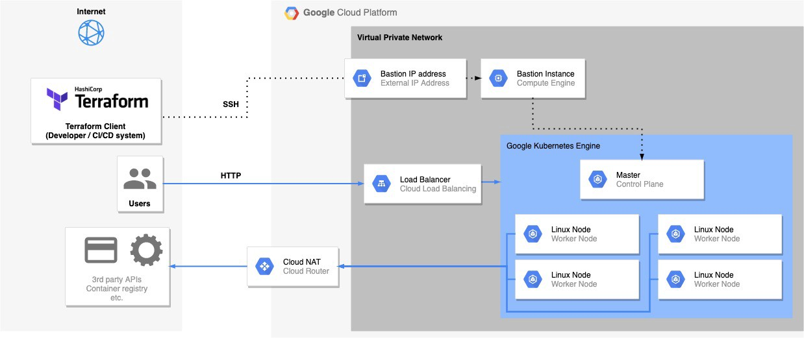

## Preparation
- [Install the gcloud CLI](https://cloud.google.com/sdk/downloads) and get it configured with [gcloud init](https://cloud.google.com/sdk/gcloud/reference/init)
- [Install the latest Terraform](https://www.terraform.io/intro/getting-started/install.html)
- [Install kubectl](https://kubernetes.io/docs/tasks/tools/)
- [Create a service account](https://cloud.google.com/iam/docs/creating-managing-service-account-keys) and download the JSON key for it
